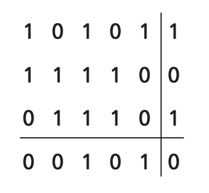

# Link Layer, ARP, and DHCP

## Introduction to the Link Layer

A **node** refers to any device that runs a link-layer protocol. The communication channels that connect adjacent nodes are referred to as **links**.

Anytime a datagram travels through a link, the datagram is encapsulated in a link-layer frame.

The link layer is implemented in a network adapter, also sometimes known as a **network interface card**.

### Services

Different link layer protocols offer different kinds of services. Some of the services a link layer protocl may offer include:

- **Framing**: The encapsulation of a network-layer datagram with a link-layer frame. A frame consists of a data field and several header fields (which differ depending on the link-layer protocol).
- **Link access**: To do with the transmission of a frame onto a link.
- **Reliable delivery**: A service that guarantees that each network-layer datagram moves across the link without error.
- **Error detection and correction**: Detection of incorrect frames such that these frames are not transmitted any further.

## Error Detection

There are three techniques that are used to determine if there are errors in the transmitted data: parity checks, checksumming methods, and cyclic redundency tests.

### Parity Checks

The simplest form of error detection is the use of a *parity bit*. The sender includes an additional bit and chooses its value such that the total number of `1`s is even (or odd, depending on the scheme):

| *d* data bits    | parity bit |
| :--------------: | :--------: |
| 0111000110101011 | 1          |

The receiver then counts the number of `1`s, and if there are odd `1`s in an even-parity scheme, then the receiver knows that an error has occured.

:::tip Note
If there are an *even* number of bit errors however, the error would not be detected!
:::

### Two-Dimensional Parity

A two dimensional parity allows the receiver to not only determine if there is an error, but to also determine *where* the error is and correct it.

The `d` bits are divided into `i` rows and `j` columns, then the parity bits are added to each row and column:

If a bit error occurs, then there will be two errors - one on the row side and one on the column side.

### Checksumming Methods

The `d` bits of data are treated as a sequence of `k`-bit integers and are summed. In the Internet, checksum is performed by treating the bytes of data as 16-bit integers then summed. The receiver then does the 1s complement of the checksum, and check if there are any 0 bits. If there are, an error has occured.

### Cyclic Redundency Tests

An error detection method widely used today is based on **cyclic redundency check** (CRC) codes.

The CRC code consists of a `r + 1` bit pattern called a **generator**. The sender then appends `r` additional bits to its `d`-bit data such that the `r + d` bits is exactly divisible by `G`. The receiver then divides the received `r + d` bits by `G`. If the result is nonzero, then an error must have occured.

## Link Layer Addressing

Each network interface has a link layer address. This address is often referred to as a MAC address. Each MAC address is 6 bytes long, and is represented in hexadecimal notation with each byte being a pair of hexadecimal numbers e.g. `1A-23-F9-CD-06-9B`.

When an adapter wants to send a frame to another adapter, it uses the destination's MAC address. The destination adapter then checks if this MAC address matches its own. If it matches, it processes the frame. Otherwise, the frame is discarded.

### Address Resolution Protocol

The address resolution protocol (ARP) translates between IP and MAC addresses. A host sends a request to translate an IP address and ARP returns with the corresponding MAC address. Note that ARP can only translate IPs on the same subnet.

Each host/router holds an ARP table that maps each IP address to a MAC address. Each entry also contains an additional TTL (time-to-live) column, that determines when the entry should be deleted from the table:

| IP address | MAC address | TTL |
| :--------: | :---------: |:--: |
| 222.222.222.221 | 88-B2-2F-54-1A-0F | 13:45:00 |
| 222.222.222.223 | 5C-66-AB-90-75-B1 | 13:52:00 |

The ARP table of a host may not necessarily contain all hosts on that subnet.

If a datagram needs to be sent the host checks if it knows the MAC address already by checking its ARP table. If it doesn't have its MAC address, it constructs an **ARP packet** that contains several fields including the sending and receiving IP and MAC addresses. The query and receiving packets are in the same format.

This packet is broadcasted to all hosts on the subnet. Each host then checks their ARP tables and, if they have the required mapping, returns the required mapping to the original host.

If a host wishes to send a packet to a *different* subnet, then it must first address the frame to the router that connects the two subnets. Then the router correctly forwards the frame and changes the MAC address to the correct destination address.

### Dynamic Host Configuration Protocol

DHCP is a protocol that allows hosts to automatically obtain an IP address. It is a four step process:

1. DHCP server discovery: The host sends a **DHCP discover** message sent using UDP to port 67. This packet is broadcasted with a destination of `255.255.255.255` and a source of `0.0.0.0`.
2. DHCP server offer: Upon receiving the discover message, a DHCP server responds with a **DHCP offer** message that is again broadcasted to all nodes on the subnet.
3. DHCP request: The client will choose one of the offers that it receives then responds with a **DHCP request** message.
4. DHCP ACK: The server confirms this by sending back a **DHCP ACK** message.

