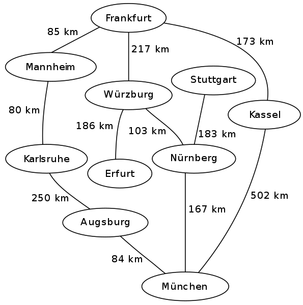
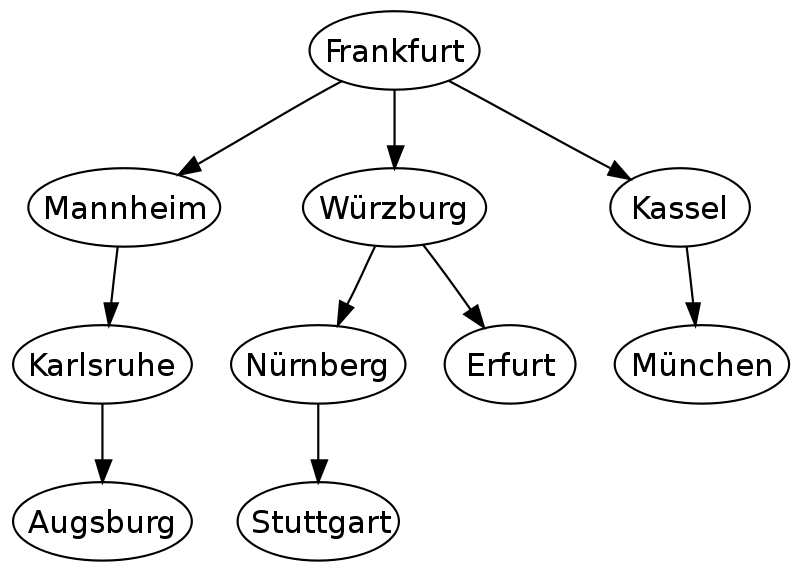
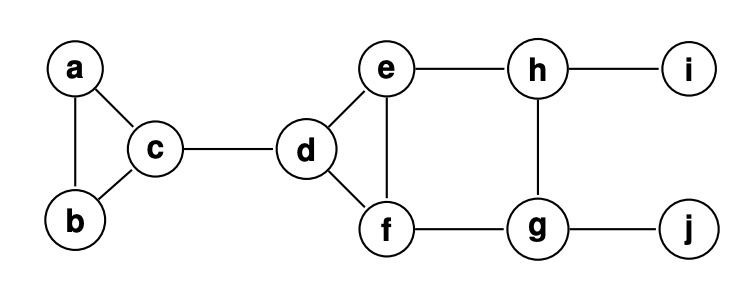
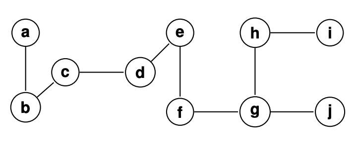
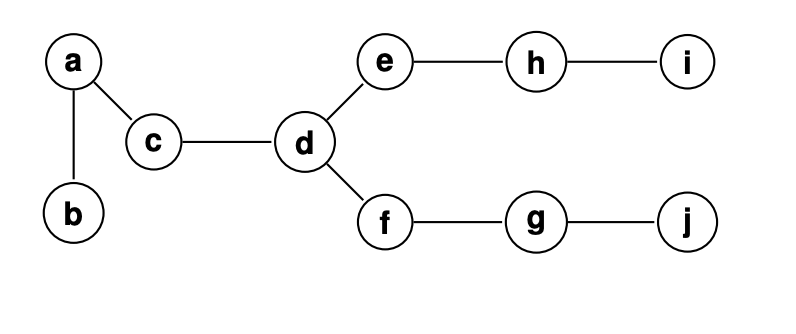

# Graphs

## Definitions

A graph `G` is a collection of vertices `V` and edges `E`. An edge `E` is defined as a subset containing two vertices, e.g. `e = {u,v}` means there is an edge between vertices `u` and `v`.

A **directed** graph is a graph where each edge is order-dependent. That is, `e = {u,v}` means there is an edge from `u` to `v` but not necessarily an edge from `v` back to `u`.

A graph is **connected** if, for every pair of vertices `(u,v)`, there is a path from `u` to `v`. If a directed graph has this property it is said to be *strongly* connected.

A strongly connected *component* of a graph is a subgraph of `G` that is strongly connected.

A directed graph is said to be **weakly** connected if the removal of the directed edges for undirected edges makes the graph connected. Directed graphs can be *both* weakly and strongly connected.

A **simple** graph is an undirected, unweighted graph with no multiple edges (no exact repeats of the same edge) and no self-loops.

A **cycle** in a graph is a collection of connected vertices `v1, v2, v3, ... vk` where `vk = v1`.

A **directed acyclic graph** (DAG) is a directed graph that contains no cycles.

## Representation

### Adjacency Matrix

For a graph with number of vertices `n`, an adjacency matrix is an `n x n` table where the entry `[u][v]` is 1 if there is an edge between `u` and `v`, and 0 otherwise.

An adjacency matrix has the following running times for typical graph operations (assuming number of vertices `n` and number of edges `m`):

| Operation | Running time |
|:--|:--:|
| Storage | O(n<sup>2</sup>) |
| Add vertex | O(n<sup>2</sup>) |
| Add edge | O(1) |
| Remove vertex | O(n<sup>2</sup>) |
| Remove edge | O(1) |
| Adjacency of `u` and `v` | O(1) |

### Adjacency List

An adjacency list is a list of length `n` where each node corresponds to a vertex. The node `u` contains a list of `u`'s neighbours.

Running time for typical operations (same assumptions as above):

| Operation | Running time |
|:--|:--:|
| Storage | O(n + m) |
| Add vertex | O(1) |
| Add edge | O(1) |
| Remove vertex | O(m) |
| Remove edge | O(n) |
| Adjacency of `u` and `v` | O(n) |

## BFS

Breadth-first search (BFS) is one of two common graph traversal algorithms. It traverses the graph layer by layer, exploring all the neighbors of the vertex before moving forward.

```
function BFS {
    Let s be the starting vertex
    Initialize Q as an empty queue
    Add s to Q
    while Q is not empty:
        v = first item in Q
        visit(v)
        for all neighbours w of v:
            if w is not visited
                add w to Q
}
```

Where `visit()` is some operation to be done on the vertex.

### Running Time

In the worst case every vertex and every edge will be explored, so the running time is `O(n + m)`, assuming the `visit()` operation is in `O(1)` time.

### Spanning Trees

BFS produces quite natural spanning trees. For example, given the following graph:



BFS would produce the following spanning tree (assuming the algorithm visits the vertices from left to right):



## DFS

Depth-first search (DFS) is the other commonly used graph traversal algorithm. Unlike BFS, DFS recursively searches the first neighbour of a vertex until it reaches a dead-end. Then it backtracks and searches its other neighbours.

```
function DFS(v) {
    visit(v)
    for all neighbours w of v
        if w is not visited
            DFS(w)
}
```

Where `visit()` is some operation on the vertex and `v` is an arbitrary starting vertex to begin the traversal.

### Running Time

For the same reason as BFS, the running time of DFS is in `O(n + m)`, provided the `visit()` operation is in `O(1)` time.

### Spanning Trees

The spanning tree of DFS does not exactly match to the original setup of the graph because of its depth-first nature. For the following graph:



The DFS algorithm would produce the following spanning tree:



Notice how this differs from BFS, where BFS will produce the following tree:



## Dijkstra's Algorithm

Dijkstra's algorithm is an algorithm to determine the shortest path between two vertices in a weighted graph. 

Given a starting node `s`, dijkstra's algorithm produces a *shortest-path tree* that shows the shortest path from `s` to every other node in the graph.

### The Algorithm

The algorithm follows the following steps:

1. Mark all nodes as unvisited.
2. Assign every node in `G` a *distance value* - 0 for the starting node, and infinity for all other nodes. Let the starting node `s` be the current node `v`. 
3. For all neighbours `w` of `v`, calculate the cummulative distance from `v` to `w`. If this calculated distance is smaller than `w`'s distance value, update `w`'s distance value.
4. Mark `v` as visited and continue traversal to the node with the smallest distance value.

### Running Time

The algorithm runs in `O(m + nlgn)`, where `m` is the number of edges in `G` and `n` the number of vertices, assuming the algorithm is implemented with a min-priority queue.

## Diameter Problem

Consider two more terms for graphs:

- Articulation point: A vertex whose removal increases the number of connected components in the graph (i.e. removing this vertex disconnects the graph).
- Diameter: The *diameter* is the maximum shortest path (number of edges) between any two nodes `u` and `v`.

Design an algorithm to determine the diameter of an undirected, unweighted, **connected** graph.

### Trivial Instances

There are three trivial instances for this diameter algorithm:

1. The empty graph - if a graph is empty, then its diameter would be 0.
2. Graph with one node - a graph with one node would have no edges and thus the diameter would also be 0.
3. Graph with *two* nodes - a graph with two nodes has only one edge connecting the two nodes. This one edge is the only shortest path, and thus its diameter would be 1.

### Small Instance

The smallest possible non-trivial instance for this problem is a graph with three nodes like follows:

```
A -- B -- C
```

There are three pairs of nodes here, `(A,B),(A,C),(B,C)`, with the shortest path lengths of `{1,2,1}` respectively. The maximum shortest path is 2, so the graph's diameter is 2.

### Brute Force

We can generate all solutions to this problem by checking the shortest path between all possible combinations of vertices:

```
function generateSolutions(G) {
    S = empty solution set
    for index i from 0 to n
        for index j from i+1 to n
            add (v_i, v_j) to S
    return S
}
```

We can then use BFS to determine the length of the shortest path between `v_i` and `v_j`. We have to do this for every pair of vertices that is generated by the brute force algorithm.

### Run Time

The run time of the brute force algorithm is in `O(n^2)` as there are two nested for loops. A BFS requires `O(n + m)` in the worst case, so the run time of the entire algorithm combined is in `O(n^2(n+m))`, which is in `O(n^3)`.

### Optimization

Note that BFS actually returns the shortest path from a vertex `v` to *all other nodes*. As a result we simply need to run BFS on every single vertex. This significantly improves the running time to `O(n(n+m))` which is in `O(n^2)`.

## Feed Forward Loops

Assignment 2 touches on the problem of feed forward loops (FFLs). An FFL is a group of three distinct nodes `a,b,c` such that there are directed edges `(a,b),(a,c),(b,c)` but not the directed edges `(b,a),(c,a),(c,b)` and no self loops.

The problem of finding all FFLs in a directed graph `G` is called the FFL detection problem.

### Solution

A simple brute force approach is to generate all possible combinations of vertices and then checking if these groups are FFLs or not.

The algorithm to generate all solutions:

```
function genSolutions(G) {
    S = empty set of solutions
    for i from 1 to n
        for j from 1 to n
            for k from 1 to n
                if (v_i, v_j, v_k) are distinct
                    add (v_i, v_j, v_k) to S
    return S
}
```

And the algorithm to check if they are an FFL is a simple if-else statement:

```
function checkValid(a, b, c) {
    if (
        (a,b) & (a,c) & (b,c)
        & !(b,a) & !(c,a) & !(c,b)
        & no self loops
    ) return true
}
```

Note that in the worst case all possible combinations of 3 vertices are FFLs. As a result, the maximum number of FFLs in a given graph `G` is in `O(n^3)`.

## Kidney Exchange Problem

The kidney exchange problem (KEP) is a problem that involves ideas from both graphs and SMP.

KEP involves an initial matching of donors and patients. Each patient has a particular preference list; the initial matching may not be the best matching with respect to this preference list. 

The **goal** of KEP is to find a better alternative matching. We use a *best-preference* graph to aid in finding this better matching. Some definitions:

- A **best-preference** graph `G_I` is as follows: a pairing `(d,p)` is a node. There is a directed edge from `(d,p)` to `(d',p')` if `d'` is the highest ranked donor in `p`'s preference list.
- A **valid** solution is any perfect matching.
- An **instability** is whenever there is a subset of pairs where a reallocation would make all pairs in this subset strictly better off.

### Solution

The following algorithm constructs a stable solution for any instance of KEP:

```
function exchange(I) {
    S = empty set of solutions
    while n > 0
        create the best preference graph G_I for I
        find a directed cycle v_1, v_2, v_3, v_k = v_1
        v_i = (d_i,p_i) for 1 <= i < k
        update instance I as follows:
            remove the pairs (d_i,p_i) from M, 1 <= i < k
            remove d_i from all patient rankings in R, 1 <= i < k
            n = n - k + 1
        add the pairs (d_i+1,p_i) to S for 1 <= i < k-1, and add (d_1,p_k-1) to S
    return S
}
```
