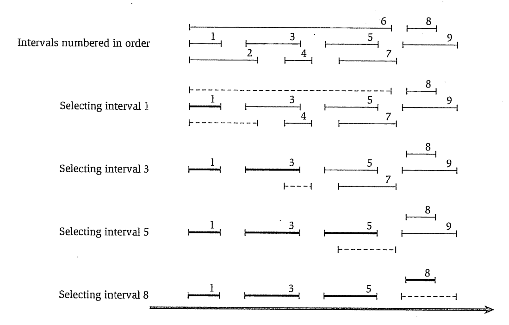

# Greedy Algorithms

A greedy algorthim is defined as an algorithm that chooses to maximize efficiency at every iteration. One example is the algorithm to solve the interval scheduling problem.

## Interval Scheduling

Say we have some resource and a set of requests `{1,2,..,n}` where the i<sup>th</sup> request corresponds to an interval of time starting at `s(i)` and finishing at `f(i)`.

### Optimal Solution

The optimal solution is achieved by first picking the request `i` that finish the fastest. This is considered *greedy* because we maximize the amount of time left to satisfy other requests.

```
R = set of all requests, A = empty set
while R is not empty
    i = request in R with smallest finishing time
    add i to A
    delete all requests not compatible with i
return A
```

The picture below shows some initial steps for some given instance of the interval scheduing problem:



## Clustering

The algorithm to solve the clustering problem performs in the following steps:

1. Sort a list of edges `E` in decreasing order by similarity.
2. Initialize each node as its own category.
3. Initialize the category count to `|V|`.
4. While there are more than `k` categories:
    1. Remove the highest similarity edge `(u,v)` from the list.
    2. If `u` and `v` are not in the same category: merge `u`'s and `v`'s categories, and reduce the category count by 1.

### Questions

Imagine we're looking at a categorization produced by our algorithm in which the inter-category edge with maximum similarity is `e`. 

Can our greedy algorithm's solution have an intra-category edge with *lower* weight than `e`?

---

Give a bound on the maximum similarity of an arbitrary solution in terms of any one of its inter-category edge weights.

---

Give a bound on the maximum similarity of a solution produced by the greedy algorithm in terms of the weight of any one of the edges it considered in step 4.

---

### Proof of Correctness

An **instance** of the clustering problem is defined as:
- `n` photos
- `k` categories
- Similarity scores for every pair of photos

A **valid solution** `S` is defined as a partition of photos into `k` non-empty categories.

The **goodness** of a solution `S` is the max similarity `sim(u,v)`, where `(u,v)` is an inter-category edge.

Our goal is to *minimize* the goodness. Let `G` be the solution provided by our greedy algorithm.

:::tip Claim
The goodness of `G` is <= the goodness of `S` for all valid solutions `S`.
:::

